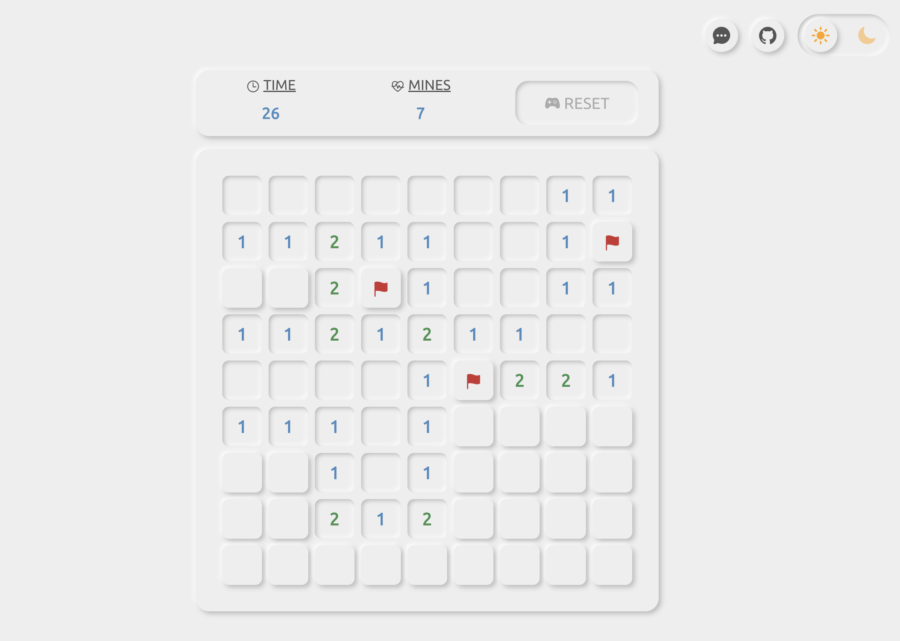

# Minesweeper

A single-player puzzle game in Neumorphic design



## Introduction

[Demo](https://alekstar79.github.io/minesweeper)

- build with Vue3, TypeScript, and Pinia
- can switch between dark/light modes
- use [ionicons](https://ionic.io/ionicons) for icons
- use [denque](https://www.npmjs.com/package/denque) for BFS array handling

## Project setup

```bash
yarn install
yarn serve
```
